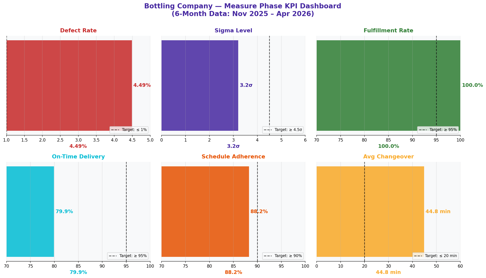

# KPI Dashboard — Executive Summary

> **Water Bottling Company — Measure Phase (D2)**  
> Six Sigma DMAIC Project | Data Period: November 2025 – April 2026

---

## Chart

---

## Key Findings (English)

- Defect rate is **4.49%** — 3.49 percentage points above the 1% target.
- Sigma Level = **3.2σ** | DPMO = **44,896** — far below the 4.5σ target.
- On-time delivery = **79.9%** vs. 95% target — a critical performance gap.
- Average changeover = **44.8 min** — more than double the 20-minute target.
- Unplanned downtime = **55.3%** of all downtime (target ≤20%).
- Customer satisfaction (CSAT) = **3.40/5** — below the 4.0/5 target.

---

## النتائج الرئيسية (عربي)

- معدل العيوب **4.49%** — أعلى من الهدف (1%) بـ 3.49 نقطة مئوية.
- مستوى سيجما = **3.2σ** | DPMO = **44,896** — بعيد عن هدف 4.5σ.
- التسليم في الوقت = **79.9%** مقابل هدف 95% — فجوة أداء حرجة.
- متوسط التحويل = **44.8 دق** — أكثر من ضعف هدف 20 دقيقة.
- التوقف غير المخطط = **55.3%** من إجمالي التوقف (الهدف ≤20%).
- رضا العملاء = **3.40/5** — أقل من الهدف 4.0/5.

---

## Chart Explanation

| Aspect | Details |
|--------|---------|
| **What** | A KPI Dashboard is a single-view summary of the most critical process metrics. |
| **Why** | Gives decision-makers an instant snapshot of process health without diving into raw data. |
| **How to read** | Each KPI shows the current value vs. target. Red = failing, Green = on track. |
| **Six Sigma use** | Used in the Measure phase to establish the baseline and quantify the problem size. |
| **Key insight** | When multiple KPIs are all in the red simultaneously, it signals a systemic process failure. |

---

## How to Create This Chart in Excel

Follow these steps to recreate this chart from the raw dataset:

1. Open the dataset sheet (e.g., "4-Defect & Quality") in Excel.
2. Calculate each KPI using formulas: =AVERAGE(), =COUNTIF(), =SUM() as needed.
3. Create a summary table: KPI | Current Value | Target | Status.
4. For the Status column use: =IF(B2<=C2,"✅ On Track","🔴 Off Target")
5. Select the KPI values → Insert → Bar Chart (Clustered) to compare current vs. target.
6. Add a secondary axis for percentage-based KPIs vs. count-based KPIs.
7. Format bars red/green based on target achievement using conditional formatting.
8. Add data labels: Right-click chart → Add Data Labels → Show Value.

---

*Part of the [Bottling Company DMAIC Project](https://github.com/Mesharymn/Bottling-Company-DMAIC-Project)*
