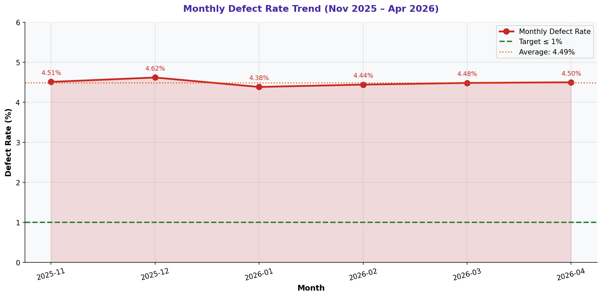

# Monthly Defect Rate Trend

> **Water Bottling Company — Measure Phase (D2)**  
> Six Sigma DMAIC Project | Data Period: November 2025 – April 2026

---

## Chart

---

## Key Findings (English)

- Defect rates ranged from **4.38%** to **4.62%** over 6 months.
- No single month achieved the **1% target** — the process is consistently out of control.
- Worst month: **2025-12** at 4.62% | Best month: **2026-01** at 4.38%.
- High month-to-month variation (0.24 pp range) indicates process instability.
- The persistent elevation above target confirms a **systemic, not random**, problem.

---

## النتائج الرئيسية (عربي)

- تراوحت معدلات العيوب بين **4.38%** و**4.62%** خلال 6 أشهر.
- لم يحقق أي شهر هدف **1%** — العملية خارجة عن السيطرة باستمرار.
- أسوأ شهر: **2025-12** بـ 4.62% | أفضل شهر: **2026-01** بـ 4.38%.
- التذبذب الشهري الكبير (نطاق 0.24 نقطة) يدل على عدم استقرار العملية.
- الارتفاع المستمر فوق الهدف يؤكد أن المشكلة **منهجية وليست عشوائية**.

---

## Chart Explanation

| Aspect | Details |
|--------|---------|
| **What** | A line chart showing how the defect rate changes month by month over 6 months. |
| **Why** | Trend analysis reveals whether the process is improving, worsening, or stable over time. |
| **How to read** | The red dashed line is the 1% target. Any point above it is a failing month. |
| **Six Sigma use** | Used to assess process stability (control) before deeper root-cause analysis. |
| **Key insight** | A flat trend above target means the problem is structural — not seasonal or random. |

---

## How to Create This Chart in Excel

Follow these steps to recreate this chart from the raw dataset:

1. Open sheet "4-Defect & Quality" in Excel.
2. Add a helper column: =TEXT(A2,"YYYY-MM") to extract the month from the Date column.
3. Create a Pivot Table: Rows = Month | Values = SUM(Units Defective) and SUM(Units Produced).
4. Add a calculated field: Defect Rate = Units Defective / Units Produced * 100.
5. Copy pivot results to a new table: Month | Defect Rate (%) | Target (1%).
6. Select both columns → Insert → Line Chart → Line with Markers.
7. Add a constant target line: right-click → Select Data → Add series with value 1 for all months.
8. Format the target line as dashed red. Add chart title and axis labels.

---

*Part of the [Bottling Company DMAIC Project](https://github.com/Mesharymn/Bottling-Company-DMAIC-Project)*
