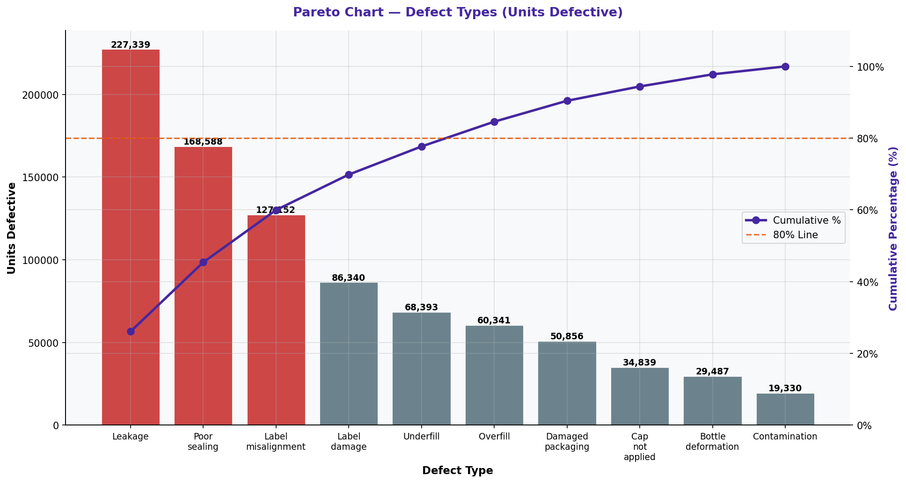

# Pareto Chart — Defect Types

> **Water Bottling Company — Measure Phase (D2)**  
> Six Sigma DMAIC Project | Data Period: November 2025 – April 2026

---

## Chart

---

## Key Findings (English)

- Top defect: **"Leakage"** = 26.1% of all defective units.
- 2nd: **"Poor sealing"** = 19.3% | 3rd: **"Label misalignment"** = 14.6%.
- Top 3 defect types = **59.9%** of all defects — confirms the 80/20 Pareto rule.
- Fixing these 3 types alone could eliminate ~60% of quality losses.
- This analysis provides clear prioritization for root cause investigation.

---

## النتائج الرئيسية (عربي)

- أكثر العيوب: **"Leakage"** = 26.1% من الوحدات المعيبة.
- الثاني: **"Poor sealing"** = 19.3% | الثالث: **"Label misalignment"** = 14.6%.
- أعلى 3 أنواع = **59.9%** من جميع العيوب — يؤكد قاعدة باريتو 80/20.
- إصلاح هذه الأنواع الثلاثة وحدها يمكن أن يُزيل ~60% من خسائر الجودة.
- يوفر هذا التحليل أولويات واضحة لتحقيق السبب الجذري.

---

## Chart Explanation

| Aspect | Details |
|--------|---------|
| **What** | A Pareto chart combines a bar chart (frequency) with a cumulative line chart (%). |
| **Why** | Visually identifies the "vital few" causes responsible for the majority of defects. |
| **How to read** | Bars are sorted highest to lowest. The line shows cumulative % reaching 80%. |
| **Six Sigma use** | Core tool in the Measure phase to prioritize which defects to investigate first. |
| **Key insight** | Focus improvement efforts on the first 2-3 bars to get the maximum quality gain. |

---

## How to Create This Chart in Excel

Follow these steps to recreate this chart from the raw dataset:

1. Open "4-Defect & Quality" → create a summary: Defect Type | Count | % of Total.
2. Sort the table by Count descending.
3. Add a Cumulative % column: =SUM($B$2:B2)/SUM($B$2:$B$10)*100.
4. Select Defect Type + Count columns → Insert → Clustered Bar Chart.
5. Right-click chart → Select Data → Add a second series for Cumulative %.
6. Right-click the Cumulative % series → Change Series Chart Type → Line.
7. Right-click the line → Format Data Series → Secondary Axis.
8. Add a horizontal reference line at 80% on the secondary axis.

---

*Part of the [Bottling Company DMAIC Project](https://github.com/Mesharymn/Bottling-Company-DMAIC-Project)*
