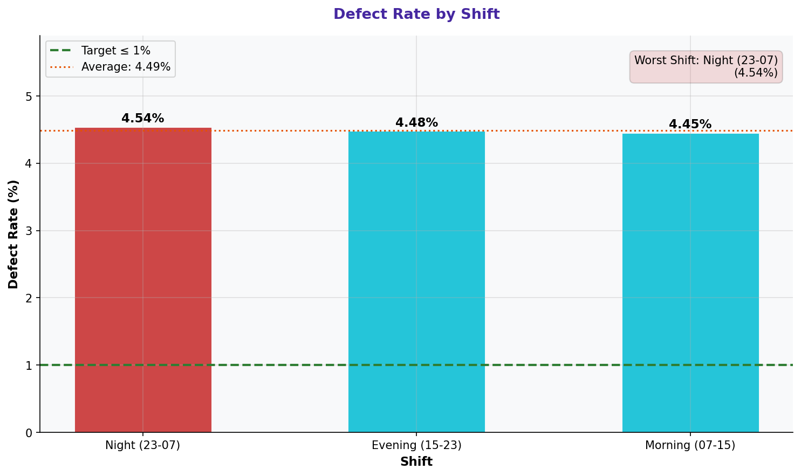

# Defect Rate by Shift

> **Water Bottling Company — Measure Phase (D2)**  
> Six Sigma DMAIC Project | Data Period: November 2025 – April 2026

---

## Chart

---

## Key Findings (English)

- **"Night (23-07)"** shift has the highest defect rate: **4.54%**.
- **"Morning (07-15)"** shift is the best performer: **4.45%**.
- Gap between worst and best shift: **0.09 percentage points**.
- Shift variation suggests human factors and supervision levels drive defect rates.
- Standardizing procedures and improving night shift oversight is recommended.

---

## النتائج الرئيسية (عربي)

- وردية **"Night (23-07)"** لديها أعلى معدل عيوب: **4.54%**.
- وردية **"Morning (07-15)"** هي الأفضل أداءً: **4.45%**.
- الفجوة بين أسوأ وأفضل وردية: **0.09 نقطة مئوية**.
- التباين بين الورديات يشير إلى أن العوامل البشرية ومستوى الإشراف يقودان معدلات العيوب.
- يُوصى بتوحيد الإجراءات وتحسين إشراف الوردية الليلية.

---

## Chart Explanation

| Aspect | Details |
|--------|---------|
| **What** | A grouped bar chart comparing the defect rate across Morning, Afternoon, and Night shifts. |
| **Why** | Shift-based stratification reveals whether human factors (fatigue, training) affect quality. |
| **How to read** | Each bar represents one shift. Higher bar = more defects in that shift. |
| **Six Sigma use** | Stratification by shift is a key step in identifying special-cause variation. |
| **Key insight** | If one shift consistently outperforms others, its practices should be standardized. |

---

## How to Create This Chart in Excel

Follow these steps to recreate this chart from the raw dataset:

1. Open "4-Defect & Quality" → create a Pivot Table.
2. Set Rows = Shift | Values = SUM(Units Defective) and SUM(Units Produced).
3. In a new table, calculate: Defect Rate (%) = Defective / Produced * 100 for each shift.
4. Select Shift + Defect Rate → Insert → Clustered Column Chart.
5. Add a reference line at the overall average defect rate.
6. Color code: red for shifts above average, green for below.
7. Add data labels: Right-click → Add Data Labels.
8. Add chart title: "Defect Rate by Shift" and label the Y-axis as "Defect Rate (%)".

---

*Part of the [Bottling Company DMAIC Project](https://github.com/Mesharymn/Bottling-Company-DMAIC-Project)*
