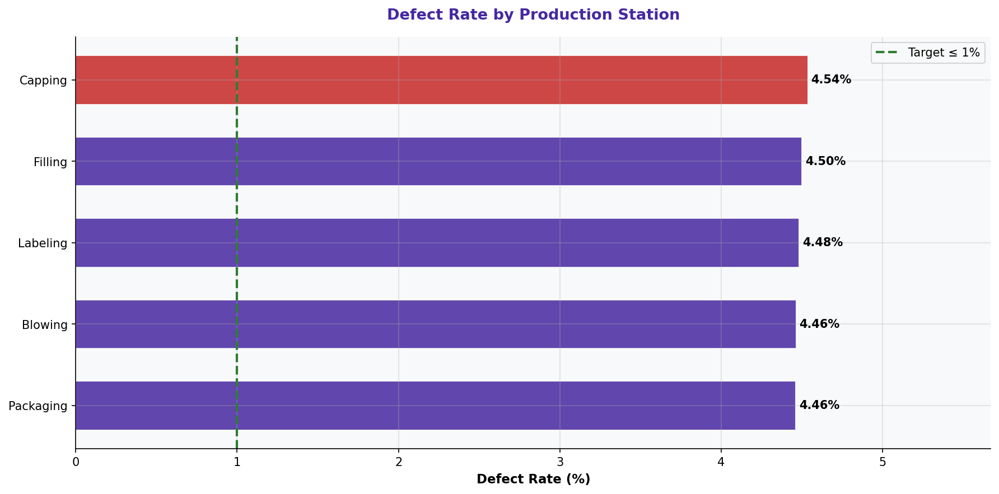

# Defect Rate by Production Station

> **Water Bottling Company — Measure Phase (D2)**  
> Six Sigma DMAIC Project | Data Period: November 2025 – April 2026

---

## Chart

---

## Key Findings (English)

- **"Capping"** station has the highest defect rate: **4.54%**.
- Station-level variation confirms machine condition and operator skill are key factors.
- Low-defect stations can serve as benchmarks for best practices.
- Focusing on **Capping** station is the highest-impact improvement opportunity.
- Detailed process mapping of the worst station is recommended in the Analyze phase.

---

## النتائج الرئيسية (عربي)

- محطة **"Capping"** لديها أعلى معدل عيوب: **4.54%**.
- التباين على مستوى المحطة يؤكد أن حالة الآلة ومهارة المشغّل عوامل رئيسية.
- المحطات ذات العيوب المنخفضة يمكن أن تكون نماذج للممارسات الأفضل.
- التركيز على محطة **Capping** هو الفرصة الأعلى تأثيراً للتحسين.
- يُوصى برسم خرائط عملية مفصّلة للمحطة الأسوأ في مرحلة التحليل.

---

## Chart Explanation

| Aspect | Details |
|--------|---------|
| **What** | A horizontal bar chart ranking each production station by its defect rate. |
| **Why** | Identifies which specific station in the production line is generating the most defects. |
| **How to read** | Longer bar = higher defect rate. The red line marks the overall average. |
| **Six Sigma use** | Station-level stratification helps focus process improvement resources precisely. |
| **Key insight** | A station with both high defects AND high downtime is a critical bottleneck. |

---

## How to Create This Chart in Excel

Follow these steps to recreate this chart from the raw dataset:

1. Open "4-Defect & Quality" → create a Pivot Table.
2. Set Rows = Station | Values = SUM(Units Defective) and SUM(Units Produced).
3. Calculate Defect Rate per station: = Defective / Produced * 100.
4. Sort by Defect Rate descending.
5. Select Station + Defect Rate → Insert → Bar Chart (Horizontal/Clustered Bar).
6. Add a vertical average reference line using a secondary series.
7. Color the highest bar red and others in a gradient.
8. Add data labels and title: "Defect Rate by Production Station".

---

*Part of the [Bottling Company DMAIC Project](https://github.com/Mesharymn/Bottling-Company-DMAIC-Project)*
