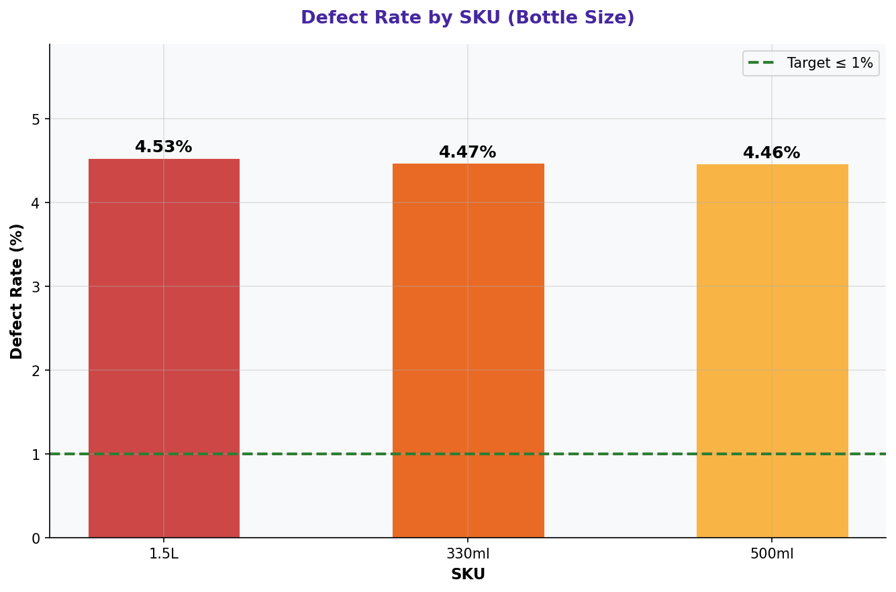

# Defect Rate by SKU (Bottle Size)

> **Water Bottling Company — Measure Phase (D2)**  
> Six Sigma DMAIC Project | Data Period: November 2025 – April 2026

---

## Chart

---

## Key Findings (English)

- **"1.5L"** SKU has the highest defect rate: **4.53%**.
- Different bottle sizes show different defect profiles — machine settings per SKU are inadequate.
- Changeover quality and setup verification are inconsistent across SKUs.
- The **1.5L** SKU should be a key stratification variable in the Analyze phase.
- SKU-specific first-article inspection after changeover is recommended.

---

## النتائج الرئيسية (عربي)

- حجم **"1.5L"** لديه أعلى معدل عيوب: **4.53%**.
- أحجام الزجاجات المختلفة تُظهر أنماط عيوب مختلفة — ضبط الآلات لكل حجم غير كافٍ.
- جودة التحويل والتحقق من الإعداد غير متسقة عبر الأحجام.
- يجب تضمين حجم **1.5L** كمتغير تصنيف رئيسي في مرحلة التحليل.
- يُوصى بفحص المنتج الأول بعد كل تحويل لكل حجم.

---

## Chart Explanation

| Aspect | Details |
|--------|---------|
| **What** | A bar chart comparing defect rates across different SKUs (330ml, 500ml, 1.5L). |
| **Why** | SKU-level analysis reveals whether specific product sizes are more prone to defects. |
| **How to read** | Each bar is a bottle size. Higher bar = more defects for that size. |
| **Six Sigma use** | Helps identify if the defect problem is universal or SKU-specific. |
| **Key insight** | SKU-specific defects often point to changeover quality or machine calibration issues. |

---

## How to Create This Chart in Excel

Follow these steps to recreate this chart from the raw dataset:

1. Open "4-Defect & Quality" → create a Pivot Table.
2. Set Rows = SKU | Values = SUM(Units Defective) and SUM(Units Produced).
3. Calculate Defect Rate per SKU: = Defective / Produced * 100.
4. Select SKU + Defect Rate → Insert → Clustered Column Chart.
5. Add a horizontal reference line at the overall average defect rate.
6. Add data labels showing the exact percentage on each bar.
7. Color the highest bar red to highlight the worst SKU.
8. Title: "Defect Rate by SKU (Bottle Size)".

---

*Part of the [Bottling Company DMAIC Project](https://github.com/Mesharymn/Bottling-Company-DMAIC-Project)*
