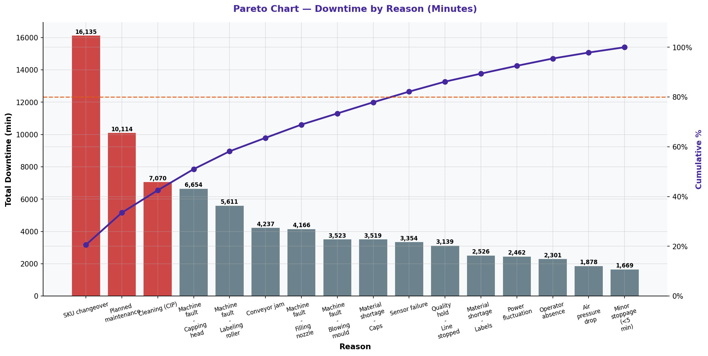

# Pareto Chart — Downtime by Reason

> **Water Bottling Company — Measure Phase (D2)**  
> Six Sigma DMAIC Project | Data Period: November 2025 – April 2026

---

## Chart

---

## Key Findings (English)

- Top downtime cause: **"SKU changeover"** = 20.6% of all downtime.
- 2nd cause: **"Planned maintenance"** = 12.9% of total downtime.
- Top 3 reasons account for **42.5%** of all downtime — clear Pareto concentration.
- Addressing top 3 causes could recover **43%** of lost production time.
- These causes should be primary targets for the Improve phase action plan.

---

## النتائج الرئيسية (عربي)

- أكبر سبب للتوقف: **"SKU changeover"** = 20.6% من إجمالي التوقف.
- السبب الثاني: **"Planned maintenance"** = 12.9% من إجمالي التوقف.
- أعلى 3 أسباب = **42.5%** من إجمالي التوقف — تركّز واضح وفق باريتو.
- معالجة الأسباب الثلاثة الأولى يمكن أن يستعيد **43%** من وقت الإنتاج الضائع.
- يجب أن تكون هذه الأسباب الأهداف الرئيسية لخطة عمل مرحلة التحسين.

---

## Chart Explanation

| Aspect | Details |
|--------|---------|
| **What** | A Pareto chart of downtime minutes sorted by root cause/reason. |
| **Why** | Identifies which downtime reasons are consuming the most production time. |
| **How to read** | Bars = total downtime minutes per reason. Line = cumulative % of total downtime. |
| **Six Sigma use** | Focuses maintenance and engineering efforts on the highest-impact downtime causes. |
| **Key insight** | Eliminating the top 2-3 reasons can recover the majority of lost production capacity. |

---

## How to Create This Chart in Excel

Follow these steps to recreate this chart from the raw dataset:

1. Open "2-Downtime & Stoppages" → create a summary: Reason | Total Duration (min).
2. Use SUMIF: =SUMIF(Reason_column, "Reason Name", Duration_column).
3. Sort by Total Duration descending.
4. Add Cumulative % column: =SUM($B$2:B2)/SUM($B$2:$B$10)*100.
5. Select Reason + Duration → Insert → Clustered Bar Chart.
6. Add Cumulative % as a second series → Change to Line → Secondary Axis.
7. Add 80% reference line on secondary axis.
8. Format bars in orange gradient, line in dark red. Add data labels.

---

*Part of the [Bottling Company DMAIC Project](https://github.com/Mesharymn/Bottling-Company-DMAIC-Project)*
