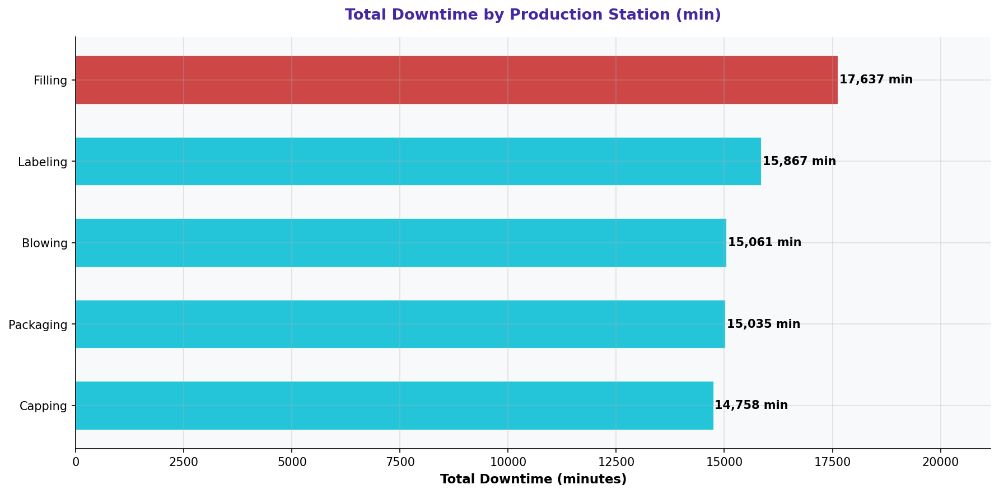

# Downtime by Production Station

> **Water Bottling Company — Measure Phase (D2)**  
> Six Sigma DMAIC Project | Data Period: November 2025 – April 2026

---

## Chart

---

## Key Findings (English)

- **"Filling"** station = 22.5% of all downtime — the single largest contributor.
- This aligns with defect analysis — confirming this station is the primary bottleneck.
- Stations with high downtime AND high defects need immediate intervention.
- A dedicated maintenance plan for top downtime stations is recommended.
- Monthly downtime by station should be tracked as a leading process health indicator.

---

## النتائج الرئيسية (عربي)

- محطة **"Filling"** = 22.5% من إجمالي التوقف — أكبر مساهم منفرد.
- هذا يتوافق مع تحليل العيوب — مما يؤكد أن هذه المحطة هي الاختناق الرئيسي.
- المحطات ذات التوقف العالي والعيوب العالية تحتاج تدخلاً فورياً.
- يُوصى بخطة صيانة مخصصة لمحطات التوقف الأعلى.
- يجب تتبع التوقف الشهري لكل محطة كمؤشر قيادي لصحة العملية.

---

## Chart Explanation

| Aspect | Details |
|--------|---------|
| **What** | A bar chart showing total downtime minutes accumulated at each production station. |
| **Why** | Pinpoints which physical location in the production line is causing the most stoppages. |
| **How to read** | Taller bar = more downtime at that station. Compare with defect rate by station. |
| **Six Sigma use** | Cross-referencing downtime and defect data by station identifies critical bottlenecks. |
| **Key insight** | A station appearing in both top-defect and top-downtime charts is the highest priority. |

---

## How to Create This Chart in Excel

Follow these steps to recreate this chart from the raw dataset:

1. Open "2-Downtime & Stoppages" → create a Pivot Table.
2. Set Rows = Station | Values = SUM(Duration (min)).
3. Sort by total downtime descending.
4. Select Station + Total Downtime → Insert → Clustered Column Chart.
5. Add a % of total label: calculate each station's share of total downtime.
6. Color the highest bar in red/orange to highlight the worst station.
7. Add data labels showing total minutes and % of total.
8. Title: "Total Downtime by Production Station (minutes)".

---

*Part of the [Bottling Company DMAIC Project](https://github.com/Mesharymn/Bottling-Company-DMAIC-Project)*
