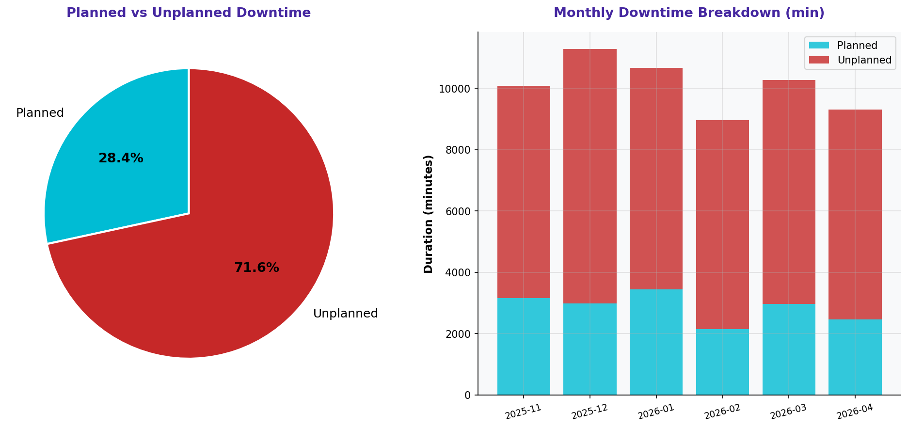

# Planned vs. Unplanned Downtime

> **Water Bottling Company — Measure Phase (D2)**  
> Six Sigma DMAIC Project | Data Period: November 2025 – April 2026

---

## Chart

---

## Key Findings (English)

- Unplanned downtime = **55.3%** of all downtime — target is ≤20%.
- High unplanned downtime indicates reactive (not preventive) maintenance dominates.
- Unplanned stoppages interrupt schedules without warning — highest disruption type.
- Corrective vs. Preventive maintenance ratio: **1175:1123** — reactive culture confirmed.
- Shifting to a proactive PM strategy is critical to reducing unplanned downtime.

---

## النتائج الرئيسية (عربي)

- التوقف غير المخطط = **55.3%** من إجمالي التوقف — الهدف ≤20%.
- التوقف غير المخطط المرتفع يدل على هيمنة الصيانة التفاعلية على الوقائية.
- التوقفات غير المخططة تقاطع الجداول دون إنذار — أعلى نوع من حيث التعطيل.
- نسبة الصيانة التصحيحية إلى الوقائية: **1175:1123** — ثقافة تفاعلية مؤكدة.
- التحول إلى استراتيجية الصيانة الوقائية الاستباقية أمر بالغ الأهمية.

---

## Chart Explanation

| Aspect | Details |
|--------|---------|
| **What** | A pie/stacked bar chart splitting downtime into Planned vs. Unplanned categories. |
| **Why** | Shows whether the organization controls its downtime (planned) or is controlled by it (unplanned). |
| **How to read** | The larger the unplanned slice, the more reactive the maintenance culture. |
| **Six Sigma use** | Establishes the baseline for maintenance effectiveness in the Measure phase. |
| **Key insight** | World-class manufacturing targets <20% unplanned downtime. Above 50% is critical. |

---

## How to Create This Chart in Excel

Follow these steps to recreate this chart from the raw dataset:

1. Open "2-Downtime & Stoppages" → filter by Type column (Planned / Unplanned).
2. Use SUMIF: =SUMIF(Type_column,"Planned",Duration_column) and same for "Unplanned".
3. Create a 2-row summary table: Type | Total Minutes | % of Total.
4. Select Type + Total Minutes → Insert → Pie Chart (2-D Pie).
5. Alternatively, use a 100% Stacked Bar Chart for a cleaner look.
6. Color: Planned = blue/green, Unplanned = red/orange.
7. Add data labels showing both the value and percentage.
8. Add a text box noting the 20% target for unplanned downtime.

---

*Part of the [Bottling Company DMAIC Project](https://github.com/Mesharymn/Bottling-Company-DMAIC-Project)*
