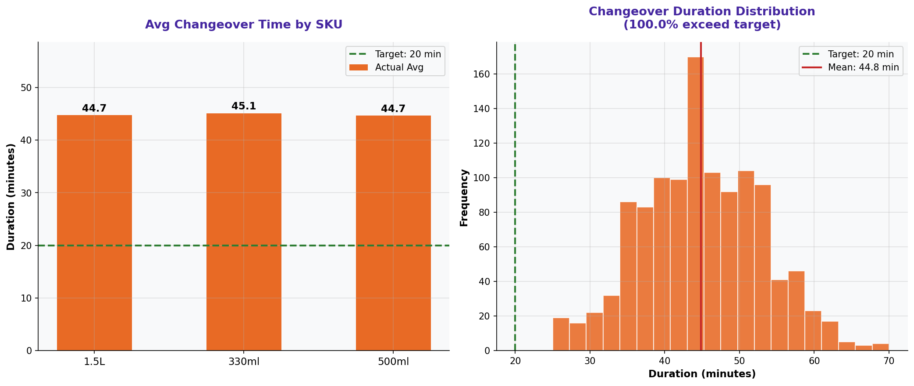

# Changeover Time Analysis

> **Water Bottling Company — Measure Phase (D2)**  
> Six Sigma DMAIC Project | Data Period: November 2025 – April 2026

---

## Chart

---

## Key Findings (English)

- **100.0%** of all changeovers exceed the 20-minute target.
- Average changeover = **44.8 min** — 24.8 min above target.
- **"330ml"** SKU transition has the longest average: **45.1 min**.
- Excessive changeover times reduce available production time and cause schedule delays.
- SMED (Single-Minute Exchange of Die) methodology is recommended to reach ≤20 min.

---

## النتائج الرئيسية (عربي)

- **100.0%** من جميع عمليات التحويل تتجاوز هدف 20 دقيقة.
- متوسط التحويل = **44.8 دق** — أعلى من الهدف بـ 24.8 دقيقة.
- انتقال **"330ml"** لديه أطول متوسط: **45.1 دقيقة**.
- أوقات التحويل المفرطة تُقلل وقت الإنتاج المتاح وتُسبب تأخيرات في الجدول.
- يُوصى بتطبيق منهجية SMED للوصول إلى ≤20 دقيقة.

---

## Chart Explanation

| Aspect | Details |
|--------|---------|
| **What** | A histogram/scatter plot showing the distribution of changeover times vs. the 20-min target. |
| **Why** | Changeover time is a major source of production loss — reducing it increases capacity. |
| **How to read** | Each data point is one changeover event. Points above the red line exceed the target. |
| **Six Sigma use** | Changeover time is a key input variable (X) affecting output (Y = production output). |
| **Key insight** | If most changeovers exceed the target, the issue is the process design, not individual operators. |

---

## How to Create This Chart in Excel

Follow these steps to recreate this chart from the raw dataset:

1. Open "3-Changeover Times" → review columns: From SKU, To SKU, Duration (min), Target (min).
2. Add a helper column: =IF(D2>E2,"Over Target","On Target") to flag violations.
3. Create a summary by SKU transition: average duration per From→To SKU pair.
4. For a histogram: select Duration column → Insert → Statistical Chart → Histogram.
5. For a scatter plot: select Date + Duration → Insert → Scatter Chart.
6. Add a horizontal reference line at 20 min (target) as a constant series.
7. Color points/bars: red if >20 min, green if ≤20 min.
8. Add title: "Changeover Duration vs. 20-Minute Target".

---

*Part of the [Bottling Company DMAIC Project](https://github.com/Mesharymn/Bottling-Company-DMAIC-Project)*
