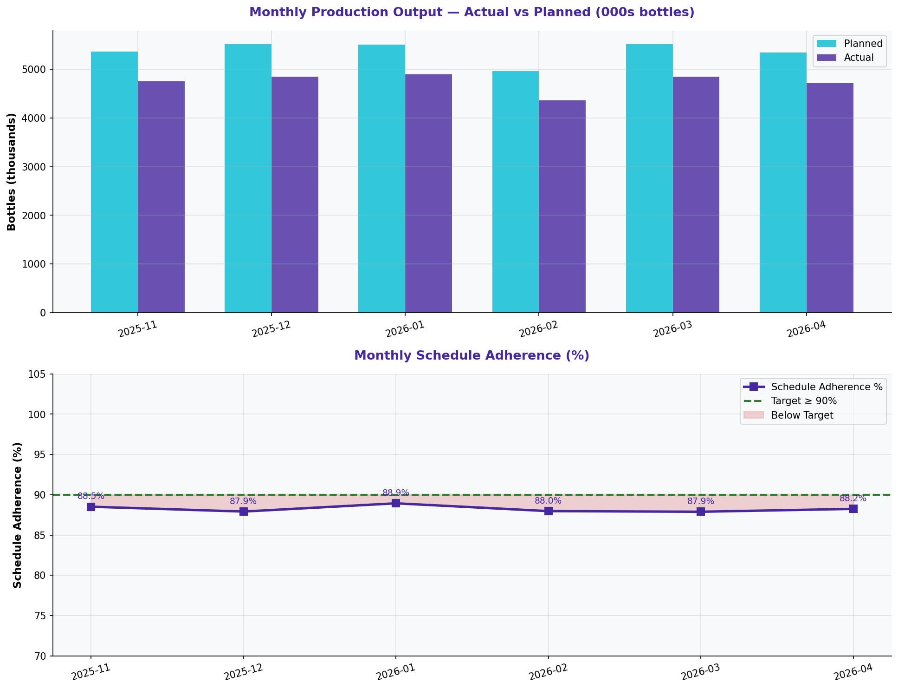

# Production Actual vs. Planned Output

> **Water Bottling Company — Measure Phase (D2)**  
> Six Sigma DMAIC Project | Data Period: November 2025 – April 2026

---

## Chart

---

## Key Findings (English)

- Total actual: **28,422,020** bottles vs. planned **32,206,042** — gap of **3,784,022** bottles.
- Output gap = **11.7%** shortfall.
- Average schedule adherence = **88.2%** (target ≥90%).
- Monthly gaps are driven by unplanned downtime, changeover delays, and quality stoppages.
- Stabilizing the process will directly improve output adherence.

---

## النتائج الرئيسية (عربي)

- الإنتاج الفعلي: **28,422,020** زجاجة مقابل المخطط **32,206,042** — فجوة **3,784,022** زجاجة.
- فجوة الإنتاج = **11.7%** عجز.
- متوسط الالتزام بالجدول = **88.2%** (الهدف ≥90%).
- الفجوات الشهرية مدفوعة بالتوقف غير المخطط وتأخيرات التحويل والتوقفات المرتبطة بالجودة.
- استقرار العملية سيُحسّن مباشرة الالتزام بالإنتاج.

---

## Chart Explanation

| Aspect | Details |
|--------|---------|
| **What** | A grouped bar chart comparing actual vs. planned production output month by month. |
| **Why** | Reveals the production gap — how much output is being lost due to process problems. |
| **How to read** | Blue bars = planned. Orange bars = actual. Gap between them = lost production. |
| **Six Sigma use** | Quantifies the business impact of process inefficiencies in financial/volume terms. |
| **Key insight** | Consistent actual < planned means the process cannot sustain its design capacity. |

---

## How to Create This Chart in Excel

Follow these steps to recreate this chart from the raw dataset:

1. Open "1-Production Output" → create a Pivot Table.
2. Set Rows = Month | Values = SUM(Actual Output) and SUM(Planned Output).
3. Copy results to a clean table: Month | Planned | Actual.
4. Select all 3 columns → Insert → Clustered Column Chart.
5. The chart will show 2 bars per month — planned (blue) and actual (orange).
6. Add a line series for Schedule Adherence % on a secondary axis.
7. Add data labels and a reference line at 90% adherence target.
8. Title: "Monthly Production: Actual vs. Planned Output".

---

*Part of the [Bottling Company DMAIC Project](https://github.com/Mesharymn/Bottling-Company-DMAIC-Project)*
