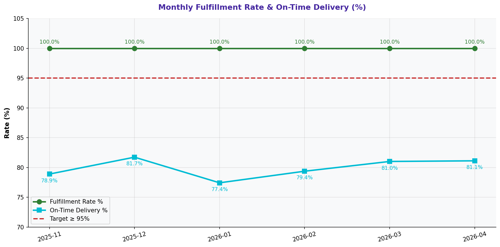

# Fulfillment Rate & On-Time Delivery

> **Water Bottling Company — Measure Phase (D2)**  
> Six Sigma DMAIC Project | Data Period: November 2025 – April 2026

---

## Chart

---

## Key Findings (English)

- Fulfillment rate avg = **100.0%** but on-time delivery = **79.9%** — a critical gap.
- **0** stockout events and **0** partial deliveries in 6 months.
- **"1.5L"** SKU has the lowest fulfillment rate: **100.0%**.
- Orders are being fulfilled but with delays — scheduling is the root issue.
- Reducing downtime and improving scheduling will directly improve on-time delivery.

---

## النتائج الرئيسية (عربي)

- متوسط معدل التنفيذ = **100.0%** لكن التسليم في الوقت = **79.9%** — فجوة حرجة.
- **0** حالة نفاد مخزون و**0** توصيل جزئي خلال 6 أشهر.
- حجم **"1.5L"** لديه أدنى معدل تنفيذ: **100.0%**.
- الطلبات تُنفَّذ لكن مع تأخيرات — الجدولة هي السبب الجذري.
- تقليل التوقف وتحسين الجدولة سيُحسّن مباشرة التسليم في الوقت المحدد.

---

## Chart Explanation

| Aspect | Details |
|--------|---------|
| **What** | A dual-axis chart showing fulfillment rate (bars) and on-time delivery % (line) per month. |
| **Why** | Distinguishes between whether orders are completed (fulfillment) vs. completed on time. |
| **How to read** | High fulfillment + low on-time = orders are done but late. Both low = capacity problem. |
| **Six Sigma use** | Connects production performance to customer-facing outcomes. |
| **Key insight** | A gap between fulfillment and on-time delivery points to scheduling/planning failures. |

---

## How to Create This Chart in Excel

Follow these steps to recreate this chart from the raw dataset:

1. Open "6-Inventory & Fulfillment" → create a Pivot Table.
2. Set Rows = Month | Values = AVERAGE(Fulfillment Rate %) and COUNTIF(On-Time Delivery,"Yes")/COUNT.
3. Copy to a clean table: Month | Fulfillment Rate | On-Time Delivery %.
4. Select all columns → Insert → Clustered Column Chart.
5. Right-click the On-Time Delivery series → Change Chart Type → Line.
6. Add secondary axis for the line series.
7. Add reference lines at 95% for both metrics.
8. Title: "Monthly Fulfillment Rate vs. On-Time Delivery %".

---

*Part of the [Bottling Company DMAIC Project](https://github.com/Mesharymn/Bottling-Company-DMAIC-Project)*
