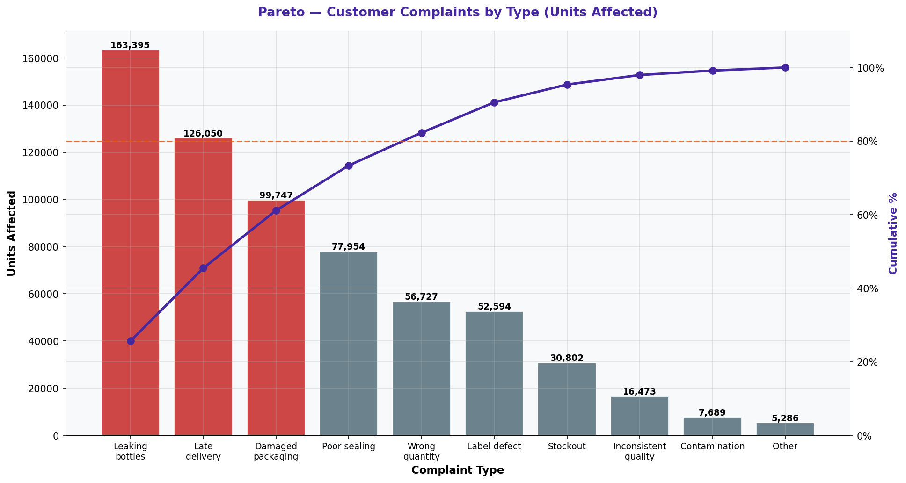

# Pareto Chart — Customer Complaints

> **Water Bottling Company — Measure Phase (D2)**  
> Six Sigma DMAIC Project | Data Period: November 2025 – April 2026

---

## Chart

---

## Key Findings (English)

- Top complaint: **"Leaking bottles"** = 25.7% of affected units.
- 2nd complaint: **"Late delivery"** = 19.8% of total complaint volume.
- Complaints directly mirror the defect types found in quality analysis — VoC confirmed.
- Resolving top 2 complaint types would address the majority of customer dissatisfaction.
- Cross-reference complaints with station and shift data to identify the root cause chain.

---

## النتائج الرئيسية (عربي)

- أكثر الشكاوى: **"Leaking bottles"** = 25.7% من الوحدات المتأثرة.
- الشكوى الثانية: **"Late delivery"** = 19.8% من إجمالي حجم الشكاوى.
- الشكاوى تعكس مباشرة أنواع العيوب الموجودة في تحليل الجودة — صوت العميل مؤكد.
- حل أعلى نوعين من الشكاوى سيعالج غالبية عدم رضا العملاء.
- قارن الشكاوى مع بيانات المحطة والوردية لتحديد سلسلة السبب الجذري.

---

## Chart Explanation

| Aspect | Details |
|--------|---------|
| **What** | A Pareto chart of customer complaint types sorted by volume of affected units. |
| **Why** | Connects internal quality data to external customer experience — the Voice of the Customer (VoC). |
| **How to read** | Bars = complaint volume. Line = cumulative %. Focus on the first 2-3 bars. |
| **Six Sigma use** | Validates that internal defects are causing real customer impact. |
| **Key insight** | If complaint types match defect types, the measurement system is aligned with customer needs. |

---

## How to Create This Chart in Excel

Follow these steps to recreate this chart from the raw dataset:

1. Open "7-Customer Complaints" → create a summary: Complaint Type | Quantity Affected.
2. Use SUMIF to aggregate by complaint type.
3. Sort by Quantity Affected descending.
4. Add Cumulative % column.
5. Select Complaint Type + Quantity → Insert → Clustered Bar Chart.
6. Add Cumulative % as a Line on Secondary Axis.
7. Add 80% reference line on secondary axis.
8. Format and title: "Pareto Analysis — Customer Complaint Types".

---

*Part of the [Bottling Company DMAIC Project](https://github.com/Mesharymn/Bottling-Company-DMAIC-Project)*
