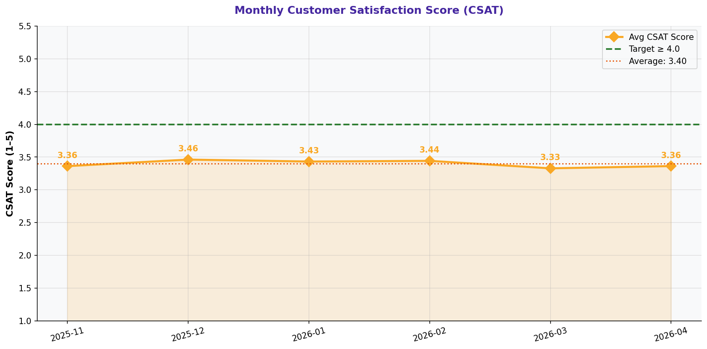

# Customer Satisfaction (CSAT) Monthly Trend

> **Water Bottling Company — Measure Phase (D2)**  
> Six Sigma DMAIC Project | Data Period: November 2025 – April 2026

---

## Chart

---

## Key Findings (English)

- Average CSAT = **3.40/5** — 0.60 pts below the 4.0/5 target.
- Only **53.2%** of customers rated 4 or above — widespread dissatisfaction.
- Worst CSAT month: **2026-03** at 3.33/5.
- Best CSAT month: **2025-12** at 3.46/5 — still below target.
- CSAT improvement depends on resolving defect, delivery, and complaint issues.

---

## النتائج الرئيسية (عربي)

- متوسط رضا العملاء = **3.40/5** — أقل من الهدف 4.0/5 بـ 0.60 نقطة.
- **53.2%** فقط من العملاء قيّموا بـ 4 أو أعلى — عدم رضا واسع النطاق.
- أسوأ شهر: **2026-03** بمتوسط 3.33/5.
- أفضل شهر: **2025-12** بمتوسط 3.46/5 — لا يزال أقل من الهدف.
- تحسين رضا العملاء يعتمد على حل مشاكل العيوب والتسليم والشكاوى.

---

## Chart Explanation

| Aspect | Details |
|--------|---------|
| **What** | A line chart tracking average customer satisfaction score (1-5) month by month. |
| **Why** | CSAT is the ultimate output metric — it reflects the cumulative impact of all process problems. |
| **How to read** | Higher line = better satisfaction. The dashed line marks the 4.0/5 target. |
| **Six Sigma use** | CSAT is the Y (output) variable that all X (input) improvements should ultimately improve. |
| **Key insight** | CSAT trends that mirror defect/delivery trends confirm the cause-effect relationship. |

---

## How to Create This Chart in Excel

Follow these steps to recreate this chart from the raw dataset:

1. Open "7-Customer Complaints" → add a helper column: =TEXT(Date,"YYYY-MM") for month.
2. Create a Pivot Table: Rows = Month | Values = AVERAGE(Customer Satisfaction Score).
3. Copy to a clean table: Month | Avg CSAT | Target (4.0).
4. Select Month + Avg CSAT → Insert → Line Chart with Markers.
5. Add Target as a constant series (value = 4.0 for all months) → format as dashed line.
6. Set Y-axis range from 1 to 5 to show the full scale.
7. Add data labels on each marker point.
8. Title: "Monthly Customer Satisfaction Score (CSAT) Trend".

---

*Part of the [Bottling Company DMAIC Project](https://github.com/Mesharymn/Bottling-Company-DMAIC-Project)*
