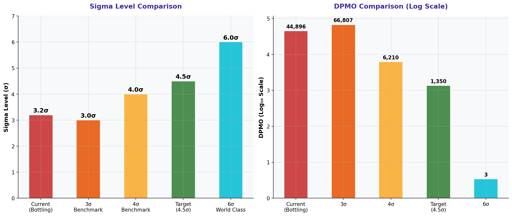

# Sigma Level & DPMO Summary

> **Water Bottling Company — Measure Phase (D2)**  
> Six Sigma DMAIC Project | Data Period: November 2025 – April 2026

---

## Chart

---

## Key Findings (English)

- Current process: **3.2σ** | DPMO = **44,896** — classified as a 3σ process.
- To reach 4.5σ target: DPMO must drop from 44,896 to ≤1,350 — a **33x improvement** needed.
- At 3.2σ, ~4.5% of all output contains defects — unacceptable for food/beverage.
- The sigma gap represents a significant process capability improvement challenge.
- Systematic elimination of top defect causes is required to achieve 4.5σ.

---

## النتائج الرئيسية (عربي)

- العملية الحالية: **3.2σ** | DPMO = **44,896** — مصنّفة كعملية 3σ.
- للوصول إلى 4.5σ: يجب تقليل DPMO من 44,896 إلى ≤1,350 — مطلوب تحسين بمقدار **33 مرة**.
- عند 3.2σ، ~4.5% من الإنتاج يحتوي على عيوب — غير مقبول في صناعة الأغذية.
- فجوة سيجما تمثل تحدياً كبيراً لتحسين قدرة العملية.
- القضاء المنهجي على أسباب العيوب الرئيسية مطلوب لتحقيق 4.5σ.

---

## Chart Explanation

| Aspect | Details |
|--------|---------|
| **What** | A gauge/bar chart showing the current Sigma Level vs. the target, with DPMO context. |
| **Why** | Sigma Level is the universal Six Sigma metric that quantifies overall process quality. |
| **How to read** | Higher sigma = better quality. 6σ = 3.4 DPMO (near-perfect). 3σ = 66,807 DPMO. |
| **Six Sigma use** | The Sigma Level is the primary baseline metric established in the Measure phase. |
| **Key insight** | Moving from 3σ to 4.5σ requires fundamental process redesign, not minor tweaks. |

---

## How to Create This Chart in Excel

Follow these steps to recreate this chart from the raw dataset:

1. Calculate DPMO: = (Total Defective Units / Total Produced Units) * 1,000,000.
2. Calculate Sigma Level in Excel: =NORM.S.INV(1-DPMO/1000000)+1.5.
3. Create a comparison table: Sigma Level | DPMO | Defect Rate % | Status.
4. Add rows for: Current, Target (4.5σ), World Class (6σ).
5. Create a horizontal bar chart: Sigma levels on Y-axis, value on X-axis.
6. Color current bar red, target bar green, world class bar gold.
7. Add a vertical reference line at the target sigma level.
8. Title: "Process Sigma Level: Current vs. Target vs. World Class".

---

*Part of the [Bottling Company DMAIC Project](https://github.com/Mesharymn/Bottling-Company-DMAIC-Project)*
