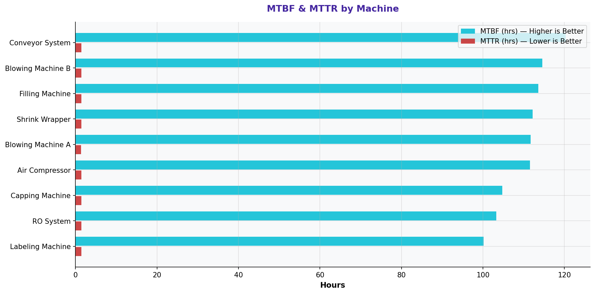

# MTBF & MTTR by Machine

> **Water Bottling Company — Measure Phase (D2)**  
> Six Sigma DMAIC Project | Data Period: November 2025 – April 2026

---

## Chart

---

## Key Findings (English)

- **"Labeling Machine"** machine: lowest MTBF = **100.2 hrs** — least reliable.
- **"Conveyor System"** machine: highest MTBF = **120.3 hrs** — most reliable.
- **21.0%** of maintenance work orders have pending issues — unresolved equipment problems.
- Corrective vs. Preventive ratio: **1175:1123** — reactive maintenance culture.
- Improving PM scheduling and spare parts management will reduce unplanned downtime.

---

## النتائج الرئيسية (عربي)

- آلة **"Labeling Machine"**: أدنى MTBF = **100.2 ساعة** — الأقل موثوقية.
- آلة **"Conveyor System"**: أعلى MTBF = **120.3 ساعة** — الأكثر موثوقية.
- **21.0%** من أوامر الصيانة لديها مشاكل معلقة — مشاكل معدات لم تُحل.
- نسبة التصحيحية إلى الوقائية: **1175:1123** — ثقافة صيانة تفاعلية.
- تحسين جدولة الصيانة الوقائية وإدارة قطع الغيار سيُقلل التوقف غير المخطط.

---

## Chart Explanation

| Aspect | Details |
|--------|---------|
| **What** | A grouped bar chart showing MTBF (Mean Time Between Failures) and MTTR (Mean Time To Repair) per machine. |
| **Why** | MTBF measures reliability (how long before failure). MTTR measures maintainability (how fast to fix). |
| **How to read** | Higher MTBF = more reliable. Lower MTTR = faster repair. Best = high MTBF + low MTTR. |
| **Six Sigma use** | Maintenance KPIs are key input variables (X) affecting production uptime (Y). |
| **Key insight** | A machine with low MTBF AND high MTTR is the highest-risk asset on the production line. |

---

## How to Create This Chart in Excel

Follow these steps to recreate this chart from the raw dataset:

1. Open "5-Maintenance Logs" → create a Pivot Table.
2. Set Rows = Machine | Values = AVERAGE(MTBF (hrs)) and AVERAGE(MTTR (hrs)).
3. Copy to a clean table: Machine | Avg MTBF | Avg MTTR.
4. Select Machine + MTBF + MTTR → Insert → Clustered Bar Chart.
5. MTBF and MTTR will appear as two bars per machine.
6. Add a secondary axis for MTTR if the scales are very different.
7. Color MTBF bars blue (higher = better), MTTR bars orange (lower = better).
8. Title: "Machine Reliability: MTBF & MTTR by Machine".

---

*Part of the [Bottling Company DMAIC Project](https://github.com/Mesharymn/Bottling-Company-DMAIC-Project)*
